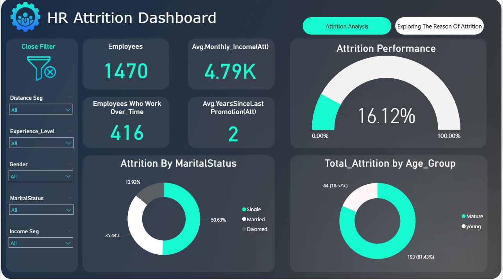

# PowerBi_Projects
# HR Attrition Analysis Dashboard

## 🚀 Project Overview
This interactive Power BI dashboard is designed to analyze and identify the key drivers behind employee attrition within an organization. It aims to empower HR departments with actionable insights to understand patterns, mitigate risks, and improve employee retention strategies.

## 📊 Key Features & Analysis
* **Overall Attrition Performance:** Displays key metrics such as total employees, attrition rate, average monthly income of leavers, and average years since last promotion.
* **Demographic Attrition Breakdown:** Analyzes attrition based on marital status, age groups, and education fields.
* **Job Role Impact:** Identifies specific job roles and departments experiencing higher attrition rates.
* **Interactive Filters:** Allows users to dynamically slice and dice data by distance segment, experience level, gender, marital status, and income segment for deeper insights.
* **Overtime Impact:** Highlights the number of employees who work overtime among those who left.

## 🛠️ Tools & Technologies
* **Power BI Desktop:** For data modeling, report design, and visualization.
* **DAX (Data Analysis Expressions):** Utilized for complex calculations and custom measures (e.g., Attrition Rate, Monthly Income for Attrited Employees).
* **Power Query (M Language):** Employed for data extraction, transformation, and loading (ETL) processes to clean and prepare raw data.
* **Data Source:** (e.g., Employee HR Data CSV, SQL Database - replace with your actual data source).

## 📸 Dashboard Screenshots
Here's a visual overview of the dashboard pages:

### Attrition Analysis Overview

### Exploring Attrition Reasons by Job Role and Education

## 💡 Learnings & Insights
*(Optional - highly recommended to show your thought process)*
* **Insight 1:** Understanding how specific job roles contribute disproportionately to overall attrition.
* **Insight 2:** Identifying correlation between factors like overtime and attrition rates.
* **Challenge Addressed:** (e.g., "Ensuring data integrity from multiple HR data extracts and transforming it into a cohesive model for analysis was a key challenge overcome using Power Query.")

## 🔗 Live Report (Interactive)
Experience the interactive dashboard directly on Power BI Service:
* [**View Live HR Attrition Dashboard**](https://app.powerbi.com/view?r=YOUR_REPORT_LINK_HERE)
    *(Replace `YOUR_REPORT_LINK_HERE` with the actual shareable link from Power BI Service)*
